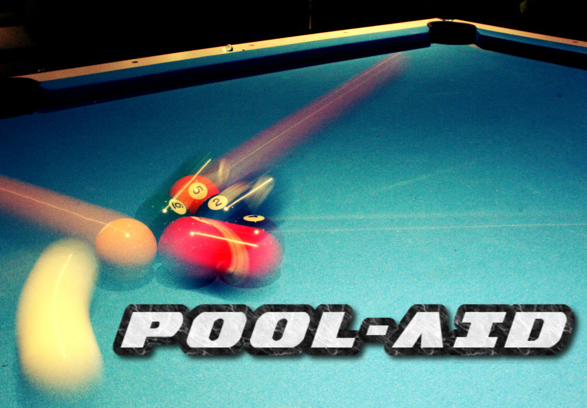
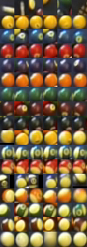
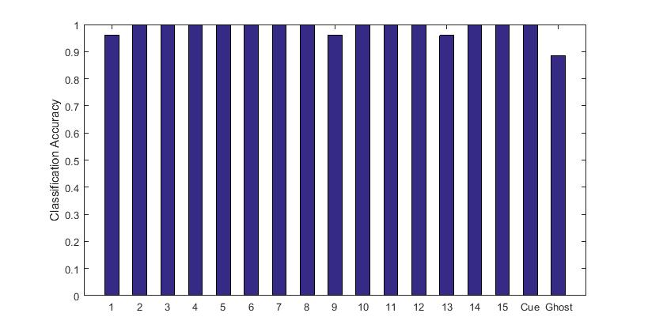
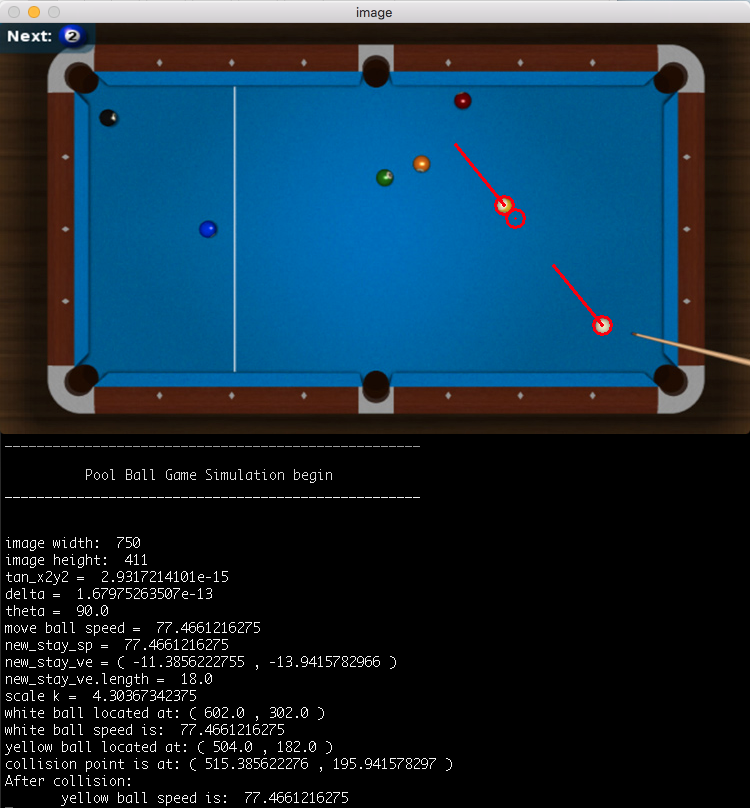
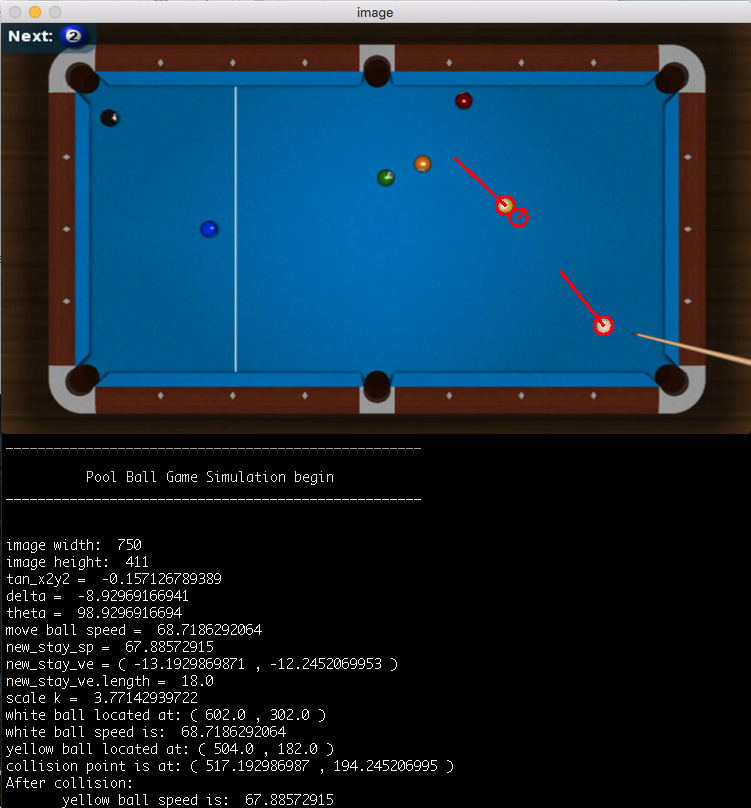
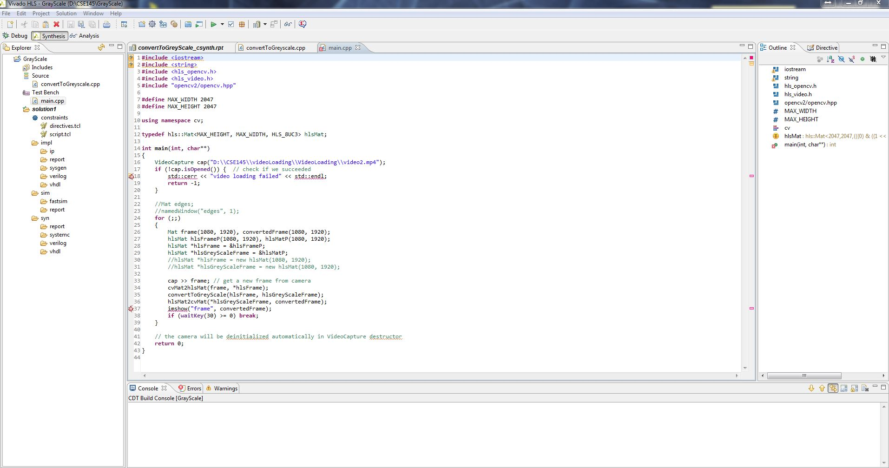
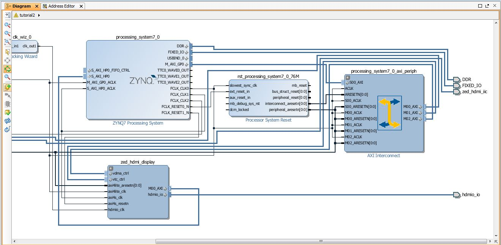
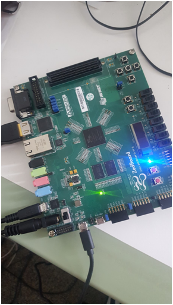
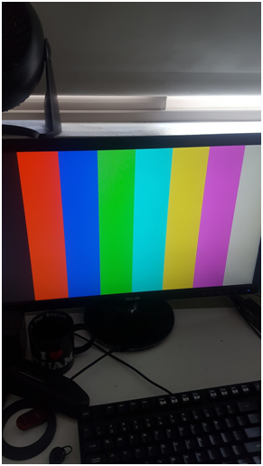

POOL-AID:   Pool-Shot-Tracking-using-FPGA
=============================

[Video here](https://www.youtube.com/watch?v=7V0d5P2D2YU)

####Team Member
<html> Brian Choi  Samuel Bauza  Olga Souverneva  Chuanqiao Edison Huang   </html>
####Project Overview

A beginning pool player can struggle visualizing the possible shots to score a point. This project will eliminate that guesswork by displaying an image of plays throughout a pool game. Pool is played with 15 balls that can be differentiated by color and demarcation. We will use specialized hardware, field-programmable gate arrays (FPGAs), for recognizing the balls in play and computing trajectories that would land the correct ball in a pool table pocket.

<html> </html>
####Project Approach

FPGAs are well suited for signal processing tasks for cyber physical systems. Compared to using a larger CPU or adding a GPU an FPGA can be more power efficient, cost effective, and have a smaller physical footprint. However while there are an increasing number of embedded development platforms used by hobbyists, FPGAs are not one of them. Hobbyists may be driven away by the more obscure programming languages, expensive development tools, and long compile time that FPGA development currently requires. An open source platform for FPGA that supports more popular languages like C/C++ and contains pre-compiled methods to shorten overall compile time can go a long ways to encourage hobbyists. To motivate the development of such a platform, we will execute a project on FPGA that would be representative of something a hobbyist may want to do at home: improve their pool game by visualizing possible shots.

<html> </html>
####Project Objectives

To motivate the development of such a platform, we will execute a project that would be represen- tative of something a hobbyist may want to do at home: improve their pool game by tracking shots and monitoring their game over time. The goal we will be achieved this quarter is to understand video processing by using FPGA and apply to pool game.

----------

<html> </html>
##Milestones:

####Pool ball subbtraction(April 11th)

The purpose of this goal is to take a well-cropped image of a pool table, and subtract all colors that are determined to be the table. What remains after the subtraction is potentially a pool ball, and will be analyzed by later algorithms.

<html> </html>
####Collect an hour of pool footage(April 15th)

The purpose of this goal is to collect a decent amount of footage to run through our algorithms, preferably under varied light conditions.

<html> </html>
####Recognition 80% accurate and integrate with detection end of pipeline(April 26th)

For these two milestones we designed a preliminary algorithm in RGB space. We tested using both the median pixel hue, R, G, and B values of the balls and the R,G,B histograms in classifying and had worse results using the median. We also integrated this with the non-optimized ball detection using Matlab and the results are shown in the video below. This did not identify the “racked” balls accurately so we implemented “racked” and “un-racked” states for detection. We plan to improve on this in Sprint 2.

<html> </html>
####Recognition improved to 95% accurate(April 30th)

To improve identification accuracy we converted the algorithm to HSV space and implemented two different error correction algorithms. First, we applied process of elimination by eliminating the ball classified with the most confidence from possible choices for other balls. This helped improve accuracy for classifying yellow or yellow-striped balls. Second, we weighed the classification confidence with proximity to past location. We found that this improved accuracy over the tested set of detected ball images.

A selection of ball images used and accuracy on the test set is reported below. If we take into account the images that contain no balls, our average accuracy is slightly less than 95%, however we expect this to be less of a problem with improvements made in ball detection. In general, our classifier performs worse on striped balls.

<html> &nbsp;&nbsp;&nbsp;&nbsp;&nbsp;&nbsp;&nbsp;&nbsp;&nbsp;&nbsp; </html>   <html> &nbsp;&nbsp;&nbsp;&nbsp;&nbsp;&nbsp;&nbsp;&nbsp;&nbsp;&nbsp;&nbsp;&nbsp;&nbsp;&nbsp; </html>  

<html> </html>
####Dynamic Table Identification(April 30th)

In the interest of easing physics calculations, as well as improving pool ball detection, the bounds of the table should be identified and transformed to fill the frame. This goal involves detecting the pool table, then cropping and rotating it in order to take up the entire frame, which will standardize calculations later in the pipeline.

<html> </html>
####Convert all code to C/C++(May 14th)

Before being implemented in HLS, we will need to convert all of our code from high level Python, to lower level C/C++. This may have the additional benefit of improving performance.

<html> </html>
####Physics engine(May 17th)

We found the physics to calculating the physics of the shot to be much simpler than determining the shot difficulty and selecting the best shot. We ran into the following difficulties: First, we had to make limiting assumptions about the velocity with which the cue ball is hit. We also found that we needed to correct for the ball center detection error and classification error.

<html> </html>
####Shot suggestion(May 17th)

The purpose of this milestone is to help player to learn better of the game siuation and make the best decision. Our work provides the best calculated path of white ball to generate easy shots for player.

----------

<html> </html>
##Project status (June 9th):

[Final report](./source/CSE145Pool-aidfinalreport.pdf)

Through working on this project we found that the following key steps are needed to upload a video processing structure onto an FPGA
1. Write HLS code using C/C++, or use existing openCV HLS libraries
2. Use Vivado HLS to generate an IP core, which can be imagined as a hardware block
3. Use a separate program to connect your custom IP core to the processor
4. Program the processor using more accessible C/C++ code, though in a way that integrates your block
5. Upload everything onto the board and processor.

Screenshots of our HLS and IP block design are shown below:

Unfortunately we found that this was much harder to complete than expected. While we were unable to load frames and actually accelerate object detection, we were able to output solid color bars form the FPGA HDMI port.

 
