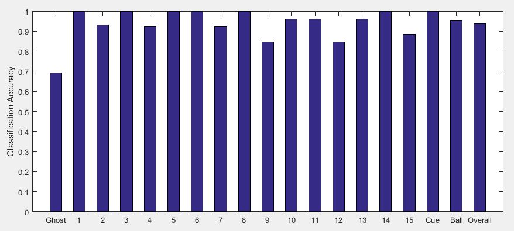

Pool-Shot-Tracking-using-FPGA
===============================
Initial code will be higher level, later in the quarter we will move to lower level c code.

Pool ball subbtraction(April 11th)
----------------------------------
The purpose of this goal is to take a well-cropped image of a pool table, and subtract all colors that are determined to be the table. What remains after the subtraction is potentially a pool ball, and will be analyzed by later algorithms.

Collect an hour of pool footage(April 15th)
-------------------------------------------
The purpose of this goal is to collect a decent amount of footage to run through our algorithms, preferably under varied light conditions.

Recognition 80% accurate and integrate with detection end of pipeline(April 26th)
--------------------------------------------------------------------------------
For these two milestones we designed a preliminary algorithm in RGB space. We tested using both the median pixel hue, R, G, and B values of the balls and the R,G,B histograms in classifying and had worse results using the median. We also integrated this with the non-optimized ball detection using Matlab and the results are shown in the video below. This did not identify the “racked” balls accurately so we implemented “racked” and “un-racked” states for detection. We plan to improve on this in Sprint 2.

Recognition improved to 95% accurate(April 30th)
------------------------------------------------
To improve identification accuracy we converted the algorithm to HSV space and implemented two different error correction algorithms. First, we applied process of elimination by eliminating the ball classified with the most confidence from possible choices for other balls. This helped improve accuracy for classifying yellow or yellow-striped balls. Second, we weighed the classification confidence with proximity to past location. We found that this improved accuracy over the tested set of detected ball images.

A selection of ball images used and accuracy on the test set is reported below. If we take into account the images that contain no balls, our average accuracy is slightly less than 95%, however we expect this to be less of a problem with improvements made in ball detection. In general, our classifier performs worse on striped balls.

<html> &nbsp;&nbsp;&nbsp;&nbsp;&nbsp;&nbsp;&nbsp;&nbsp;&nbsp;&nbsp; </html>   <html> &nbsp;&nbsp;&nbsp;&nbsp;&nbsp;&nbsp;&nbsp;&nbsp;&nbsp;&nbsp;&nbsp;&nbsp;&nbsp;&nbsp; </html>  

Dynamic Table Identification(April 30th)
----------------------------------------
In the interest of easing physics calculations, as well as improving pool ball detection, the bounds of the table should be identified and transformed to fill the frame.. This goal involves detecting the pool table, then cropping and rotating it in order to take up the entire frame, which will standardize calculations later in the pipeline.

Convert all code to C/C++(May 14th)
-----------------------------------
Before being implemented in HLS, we will need to convert all of our code from high level Python, to lower level C/C++. This may have the additional benefit of improving performance.

Physics engine(May 18th)
------------------------
We found the physics to calculating the physics of the shot to be much simpler than determining the shot difficulty and selecting the best shot. We ran into the following difficulties: First, we had to make limiting assumptions about the velocity with which the cue ball is hit. We also found that we needed to correct for the ball center detection error and classification error.

